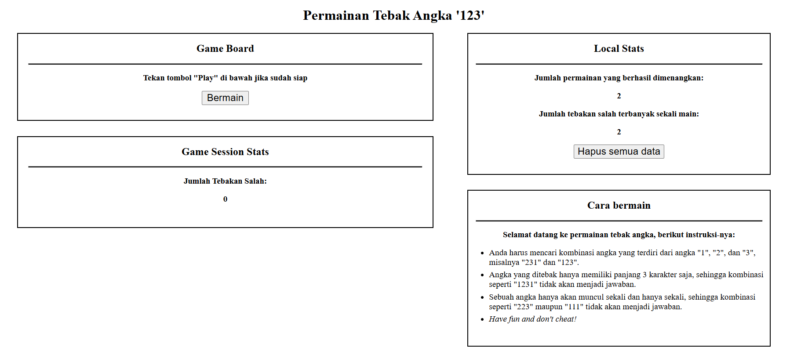

# latihanWebStorage
saya membuat localstorage menggunakan javascript tidak pakai backend

# 🎮 Web Storage Projects — Game & User Manager

Koleksi project JavaScript yang menggunakan Web Storage API (localStorage & sessionStorage).
Repository ini berisi dua aplikasi:

## 1️⃣ Game Tebak Angka: "123 Shuffle Guessing Game"

File: index.html

Sebuah permainan sederhana di mana pemain harus menebak urutan angka 1, 2, dan 3 secara acak.

🧩 Fitur Game
---
Randomisasi urutan angka "123" menggunakan algoritma shuffle

Tombol input angka: 1, 2, dan 3

Menampilkan:

Jawaban user

Jawaban salah terakhir

Total kesalahan (tebakan salah)

Sistem session menggunakan sessionStorage

Menyimpan:

Jawaban sebenarnya (answer)

Total tebakan salah dalam sesi

Reset otomatis saat refresh

Sistem statistik menggunakan localStorage

Total kemenangan yang pernah dicapai

Rekor jumlah tebakan salah terbanyak

🕹 Cara Bermain
---

Tekan tombol Bermain

Masukkan tebakan (3 angka berbeda antara 1–3)

Jika salah → game mencatat kesalahan

Jika benar → tampil halaman kemenangan

Refresh untuk memulai ulang

# 2️⃣ User Manager — CRUD + Search + Sort + Pagination

File: user-manager.html

Aplikasi manajemen data user sederhana menggunakan localStorage.
Cocok sebagai latihan CRUD + DOM + Web Storage.

## ✨ Fitur Utama

✔ Tambah User

Input: Nama, Umur (angka), Domisili

Validasi umur: hanya angka, max 2 digit

Auto-save ke localStorage

✔ Edit User

Tombol edit akan:

Memuat data ke form

Mengubah tombol menjadi Update User

✔ Hapus User

Tombol delete menghapus user dari localStorage dan tabel

✔ Search (Pencarian Nama)

Filter realtime berdasarkan nama

Menggunakan event keyup

✔ Sorting (Urutkan)

Nama A→Z

Nama Z→A

Umur termuda→tertua

Umur tertua→termuda

Tanpa sorting

✔ Pagination (5 data per halaman)

Previous / Next

Nomor halaman

Auto update ketika:

Search

Sorting

Tambah/Edit/Hapus user

✔ UI Modern (CSS)

Card UI

Hover effect

Button style profesional

# 🗂 Struktur File
/
│── index.html             → Game Tebak Angka (sessionStorage + localStorage)
│── user-manager.html      → Aplikasi CRUD User (localStorage)
│── README.md              → Dokumentasi project

# 🛠 Teknologi yang Digunakan

HTML5

CSS3 (Custom styling)

Vanilla JavaScript

sessionStorage API

localStorage API

DOM Manipulation

Event Handling

Dynamic Rendering + Pagination

# 📌 Cara Menjalankan

Download atau clone repo:

git clone https://github.com/ranggautama47/latihanWebStorage.git

Buka salah satu file berikut di browser:
--

index.html → Mainkan game tebak angka

user-manager.html → Gunakan aplikasi User Manager

Tidak butuh server — cukup klik 2x file HTML.

## 🖼 Screenshots

### 🎮 Game Tebak Angka

### 👤 User Manager

